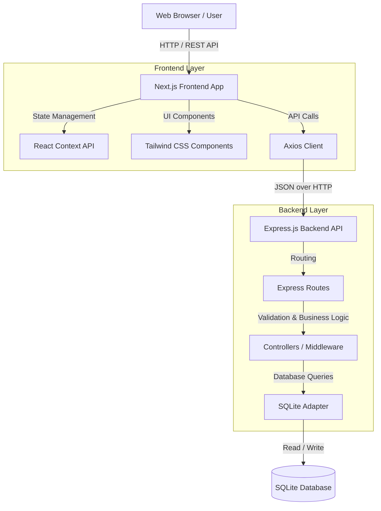
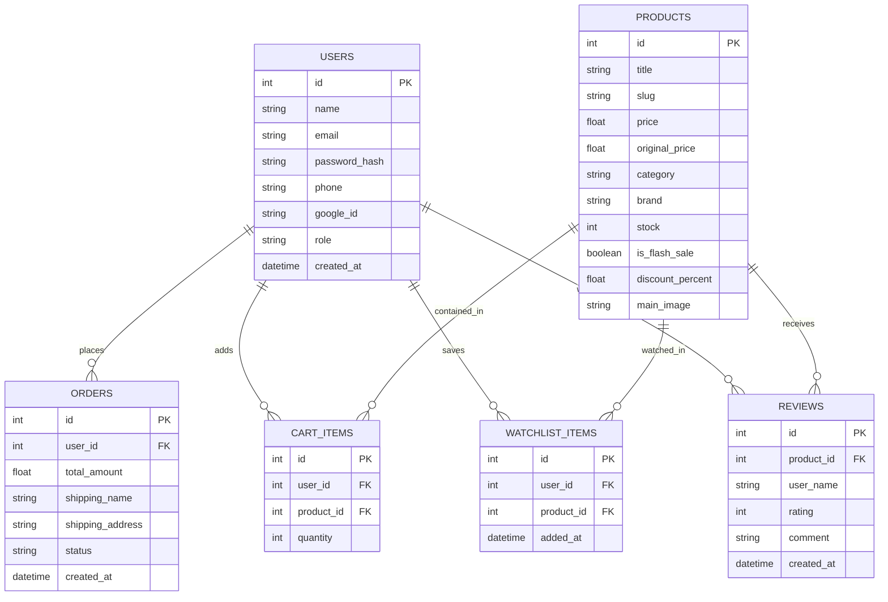

# Architecture Diagrams

This document contains publication-ready diagrams representing the architecture and design of the Legacy Watches e-commerce platform. These can be used in presentations, reports, and documentation.

## 1. High-Level System Architecture

The project follows a standard 3-tier architecture, utilizing a decoupled frontend and backend for scalability and maintainability.



## 2. Component Diagram

A closer look at the specific modules and routes that make up the system.

```mermaid
graph LR
    subgraph "Next.js Frontend (App Router)"
        Home[Page: /]
        Shop[Page: /shop]
        Product[Page: /products/:slug]
        UserDash[Page: /profile, /orders]
        AdminDash[Page: /admin/*]
        Cart[Page: /cart]
    end

    subgraph "Express Backend Routes"
        AuthAPI[/api/auth]
        ProductAPI[/api/products]
        CartAPI[/api/cart]
        OrderAPI[/api/orders]
        ReviewAPI[/api/reviews]
        AdminAPI[/api/admin]
    end

    Home --> ProductAPI
    Shop --> ProductAPI
    Product --> ProductAPI
    Product --> ReviewAPI
    UserDash --> AuthAPI
    UserDash --> OrderAPI
    AdminDash --> AdminAPI
    Cart --> CartAPI
```

## 3. Entity-Relationship Diagram (ERD)

The database schema, implemented via a local JSON/SQLite adapter, consists of the following core entities and their relationships.


