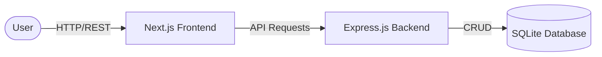
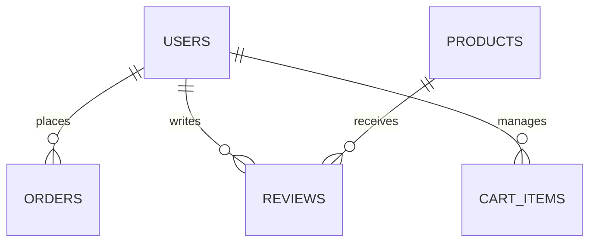

# Legacy Watches
## Premium E-Commerce Platform
**University Project Defense**
**Presented By:** [Your Name/Group]

---

## 1. Introduction & Problem Statement
- **The Context:** Traditional watch shopping requires visiting physical stores, limiting options and convenience.
- **The Problem:** Many online watch stores lack a modern, intuitive user interface and performant browsing experience.
- **The Need:** A dedicated, fast, and secure platform for watch enthusiasts to browse, wishlist, and purchase premium watches seamlessly.

---

## 2. Project Objectives
- Build a responsive and visually appealing web application.
- Implement secure user authentication and profile management.
- Develop a robust product catalog with search and filtering capabilities.
- Create a streamlined cart and checkout process.
- Provide an administrative dashboard for business management.

---

## 3. Technology Stack
**Frontend:**
- **Next.js (App Router):** For server-side rendering and fast page loads.
- **React & Tailwind CSS:** For a modern, responsive, and dynamic user interface.

**Backend:**
- **Node.js & Express.js:** A lightweight, fast REST API.
- **SQLite (JSON Wrapper):** A custom database implementation for rapid prototyping without complex infrastructure overhead.

---

## 4. Key User Features
- **Smart Catalog:** Browse by category, brand, and flash sales.
- **Authentication:** Secure login and registration (JWT & bcrypt).
- **Cart & Watchlist:** Persistent shopping cart and favorite items saving.
- **Order Tracking:** Users can view their past orders and current order statuses.
- **Product Reviews:** Customers can leave ratings and comments on purchased watches.

---

## 5. Administrative Features
- **Admin Dashboard:** Overview of total users, revenue, and active orders.
- **Order Management:** View and process recent transactions.
- **User Management:** Monitor registered accounts.
- **Database Seeding:** Automated data generation for easy setup and testing.

---

## 6. System Architecture

- **Decoupled System:** Frontend and Backend run independently.
- **Security First:** Token-based authentication secures private endpoints.

---

## 7. Database Design Overview

*Core Entities: Users, Products, Orders, Reviews, Cart, Watchlist.*

---

## 8. Future Enhancements
- **Payment Gateway Integration:** Integrating SSLCommerz or Stripe for real transactions.
- **Advanced Search:** Implementing full-text search with ElasticSearch.
- **Database Migration:** Moving from SQLite to PostgreSQL for production scalability.
- **Email Notifications:** Automated receipts and shipping updates.

---

# Thank You!
## Any Questions?
