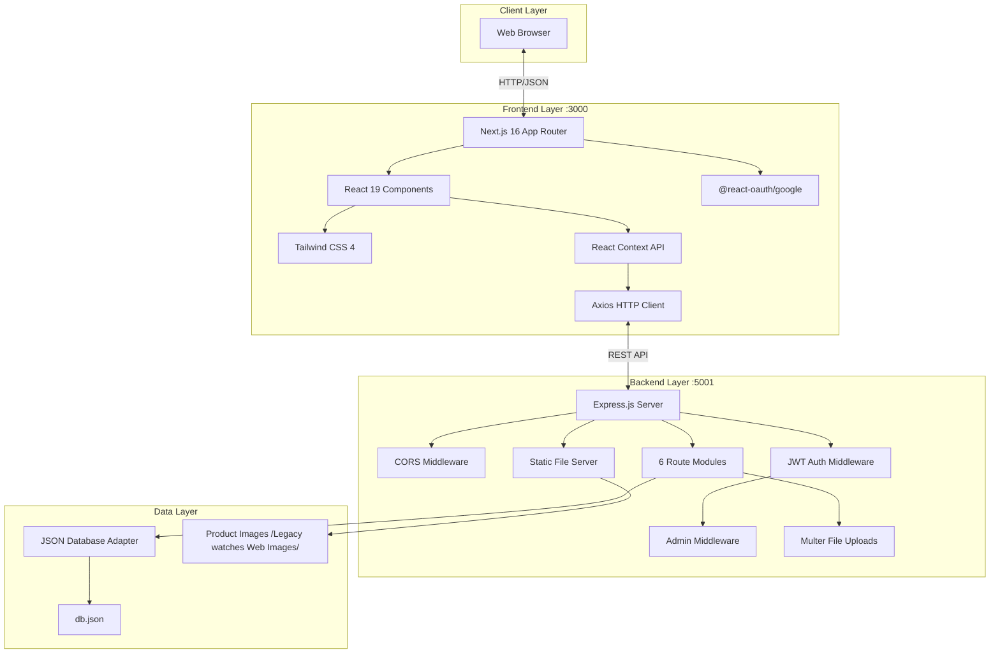
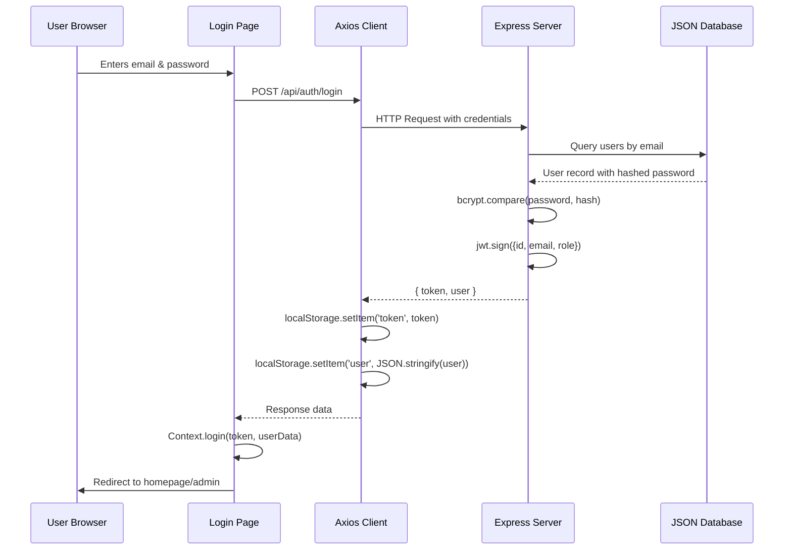
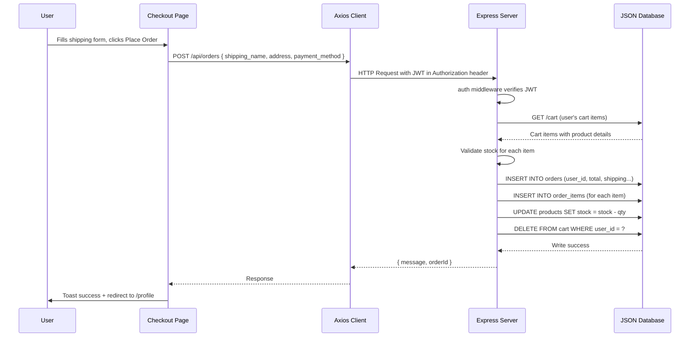
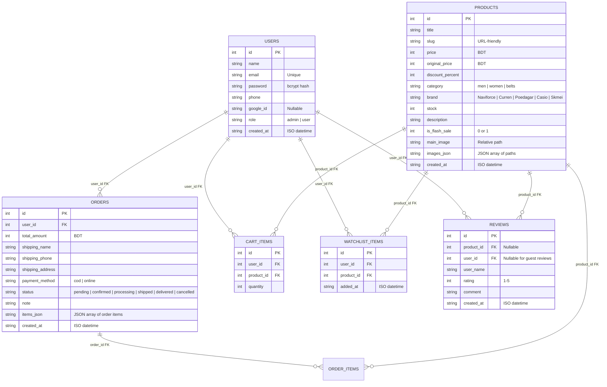
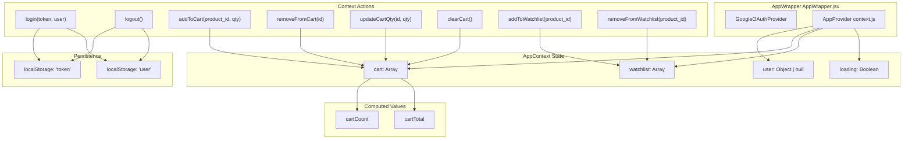

# Legacy Watches — System Architecture & Design Diagrams

This document contains publication-quality diagrams representing the architecture, component structure, data flow, and database design of the Legacy Watches e-commerce platform.

---

## 1. High-Level System Architecture

The project follows a decoupled 3-tier architecture: a Next.js frontend, an Express.js REST API backend, and a JSON-based data layer.



---

## 2. Frontend Component Tree

The Next.js App Router organizes pages into route groups. Each page is composed of reusable components.

```mermaid
graph TD
    RootLayout["RootLayout layout.tsx"]
    AppWrapper["AppWrapper GoogleOAuthProvider + AppProvider"]
    Toaster["react-hot-toast Toaster"]

    RootLayout --> AppWrapper

    AppWrapper --> HomePage["/ page.tsx"]
    AppWrapper --> AuthGroup["/(auth)"]
    AppWrapper --> UserGroup["/(user)"]
    AppWrapper --> AdminGroup["/admin"]

    HomePage --> HeroBanner["HeroBanner.jsx"]
    HomePage --> WatchExplorer["WatchExplorer.jsx"]
    HomePage --> ProductCard["ProductCard.jsx"]
    HomePage --> Footer["Footer.jsx"]

    AuthGroup --> LoginPage["/login/page.jsx"]
    AuthGroup --> RegisterPage["/register/page.jsx"]
    LoginPage --> AuthModal["AuthModal.jsx"]
    RegisterPage --> AuthModal

    UserGroup --> ShopPage["/shop/page.jsx"]
    UserGroup --> ProductDetail["/product/[id]/page.jsx"]
    UserGroup --> CartPage["/cart/page.jsx"]
    UserGroup --> CheckoutPage["/checkout/page.jsx"]
    UserGroup --> WatchlistPage["/watchlist/page.jsx"]
    UserGroup --> ProfilePage["/profile/page.jsx"]
    UserGroup --> ReviewsPage["/reviews/page.jsx"]
    UserGroup --> FlashSalePage["/flash-sale/page.jsx"]
    UserGroup --> AboutPage["/about-us/page.jsx"]
    UserGroup --> ContactPage["/contact-us/page.jsx"]
    UserGroup --> CategoryPage["/shop/[category]/page.jsx"]

    ShopPage --> Navbar["Navbar.jsx"]
    ProductDetail --> Navbar
    CartPage --> Navbar
    CheckoutPage --> Navbar
    WatchlistPage --> Navbar
    ProfilePage --> Navbar
    ReviewsPage --> Navbar
    FlashSalePage --> Navbar
    AboutPage --> InfoLayout["InfoLayout.jsx"]
    ContactPage --> InfoLayout
    CategoryPage --> ShopPage

    AdminGroup --> AdminDashboard["/admin/page.jsx"]
    AdminGroup --> AdminProducts["/admin/products/page.jsx"]
    AdminGroup --> AdminOrders["/admin/orders/page.jsx"]

    Navbar --> MegaMenu["MegaMenu Component"]
    Navbar --> AuthModal
```



---

## 3. Backend Route Architecture

The Express server loads 6 modular route files plus inline admin routes. Each route module handles a specific resource domain.

```mermaid
graph TD
    Server["server.js Express App :5001"]

    Server --> HealthCheck["GET /api/health"]
    Server --> AdminStats["GET /api/admin/stats"]
    Server --> AdminUsers["GET /api/admin/users"]

    Server --> AuthRoutes["/api/auth auth.js"]
    Server --> ProductRoutes["/api/products products.js"]
    Server --> CartRoutes["/api/cart cart.js"]
    Server --> WatchlistRoutes["/api/watchlist watchlist.js"]
    Server --> OrderRoutes["/api/orders orders.js"]
    Server --> ReviewRoutes["/api/reviews reviews.js"]

    AuthRoutes --> Register["POST /register"]
    AuthRoutes --> Login["POST /login"]
    AuthRoutes --> GoogleLogin["POST /google"]

    ProductRoutes --> ListProducts["GET /"]
    ProductRoutes --> GetProduct["GET /:slugOrId"]
    ProductRoutes --> CreateProduct["POST / 🔒Admin"]
    ProductRoutes --> UpdateProduct["PUT /:id 🔒Admin"]
    ProductRoutes --> DeleteProduct["DELETE /:id 🔒Admin"]

    CartRoutes --> GetCart["GET / 🔒"]
    CartRoutes --> AddToCart["POST / 🔒"]
    CartRoutes --> UpdateQty["PUT /:id 🔒"]
    CartRoutes --> RemoveItem["DELETE /:id 🔒"]
    CartRoutes --> ClearCart["DELETE / 🔒"]

    WatchlistRoutes --> GetWatchlist["GET / 🔒"]
    WatchlistRoutes --> AddWatchlist["POST / 🔒"]
    WatchlistRoutes --> RemoveWatchlist["DELETE /:product_id 🔒"]
    WatchlistRoutes --> CheckWatchlist["GET /check/:product_id 🔒"]

    OrderRoutes --> PlaceOrder["POST / 🔒"]
    OrderRoutes --> MyOrders["GET /my 🔒"]
    OrderRoutes --> AllOrders["GET /admin/all 🔒Admin"]
    OrderRoutes --> UpdateStatus["PUT /:id/status 🔒Admin"]

    ReviewRoutes --> GetReviews["GET /"]
    ReviewRoutes --> AddReview["POST / 🔒"]
    ReviewRoutes --> GuestReview["POST /guest"]
```



---

## 4. Data Flow: User Authentication



---

## 5. Data Flow: Order Placement



---

## 6. Entity-Relationship Diagram (JSON Database Schema)

The database is stored in a single [`db.json`](backend/database/db.json) file with 6 collections (arrays). The relationships are maintained through foreign key references validated by the application layer.



---

## 7. Frontend State Management Architecture

The application uses React Context API for global state management, supplemented by local component state and localStorage persistence.



---

## 8. Page Route Map

```
/                           → Homepage (Hero + WatchExplorer + Categories + Best Sellers)
/(auth)/login               → Login Page
/(auth)/register            → Register Page
/(user)/shop                → Shop (Product listing with filters)
/(user)/shop/[category]     → Category-specific shop (delegates to ShopPage)
/(user)/product/[id]        → Product Detail Page
/(user)/cart                → Shopping Cart
/(user)/checkout            → Checkout (Shipping form + Order review)
/(user)/watchlist           → Saved items (Watchlist)
/(user)/profile             → User Profile + Order History
/(user)/reviews             → All Customer Reviews
/(user)/flash-sale          → Flash Sale Products with countdown timer
/(user)/about-us            → About Us (InfoLayout)
/(user)/contact-us          → Contact Us with store info + message form (InfoLayout)
/admin                      → Admin Dashboard (Stats + Recent Orders)
/admin/products             → Admin Product Management (CRUD table)
/admin/orders               → Admin Order Fulfillment (Status management)
```

---

## 9. Technology Stack Summary

| Layer | Technology | Version |
|-------|-----------|---------|
| **Frontend Framework** | Next.js (App Router) | 16.2.4 |
| **UI Library** | React | 19.2.4 |
| **Styling** | Tailwind CSS | 4 |
| **Language** | TypeScript / JavaScript (JSX) | 5 |
| **HTTP Client** | Axios | Latest |
| **Icons** | Lucide React | Latest |
| **Carousel** | Swiper.js | Latest |
| **Notifications** | react-hot-toast | Latest |
| **Google Auth** | @react-oauth/google | Latest |
| **Backend Runtime** | Node.js | 18+ |
| **Backend Framework** | Express.js | Latest |
| **Authentication** | jsonwebtoken + bcryptjs | Latest |
| **File Upload** | Multer | Latest |
| **Database** | Custom JSON-based adapter | N/A |
| **Fonts** | Inter + Playfair Display (Google Fonts) | — |

---

## 10. Project Directory Structure

```
Legacy Watches Project 2/
├── backend/
│   ├── server.js                  # Express server entry point
│   ├── package.json               # Backend dependencies
│   ├── middleware/
│   │   ├── auth.js               # JWT authentication middleware
│   │   └── admin.js              # Admin role check middleware
│   ├── routes/
│   │   ├── auth.js               # Authentication routes
│   │   ├── products.js           # Product CRUD routes
│   │   ├── cart.js               # Cart management routes
│   │   ├── watchlist.js          # Watchlist routes
│   │   ├── orders.js             # Order management routes
│   │   └── reviews.js            # Review routes
│   └── database/
│       ├── db.js                 # JSON database adapter
│       ├── db.json               # Data store (users, products, orders, etc.)
│       └── seed.js               # Database seeder
├── frontend/
│   ├── package.json              # Frontend dependencies
│   ├── next.config.mjs           # Next.js configuration
│   ├── tsconfig.json             # TypeScript configuration
│   ├── app/
│   │   ├── layout.tsx            # Root layout (fonts, AppWrapper)
│   │   ├── page.tsx              # Homepage
│   │   ├── globals.css           # Global styles + Tailwind
│   │   ├── (auth)/               # Auth route group
│   │   │   ├── login/page.jsx
│   │   │   └── register/page.jsx
│   │   ├── (user)/               # User-facing route group
│   │   │   ├── shop/page.jsx
│   │   │   ├── shop/[category]/page.jsx
│   │   │   ├── product/[id]/page.jsx
│   │   │   ├── cart/page.jsx
│   │   │   ├── checkout/page.jsx
│   │   │   ├── watchlist/page.jsx
│   │   │   ├── profile/page.jsx
│   │   │   ├── reviews/page.jsx
│   │   │   ├── flash-sale/page.jsx
│   │   │   ├── about-us/page.jsx
│   │   │   └── contact-us/page.jsx
│   │   └── admin/                # Admin route group
│   │       ├── page.jsx
│   │       ├── products/page.jsx
│   │       └── orders/page.jsx
│   ├── components/
│   │   ├── Navbar.jsx            # Navigation with MegaMenu
│   │   ├── HeroBanner.jsx        # Video hero section
│   │   ├── WatchExplorer.jsx     # Swiper watch carousel
│   │   ├── ProductCard.jsx       # Reusable product card
│   │   ├── Footer.jsx            # Site footer
│   │   ├── AuthModal.jsx         # Login/Register modal
│   │   └── InfoLayout.jsx        # Info page layout wrapper
│   └── lib/
│       ├── api.js                # Axios instance + API helpers
│       ├── context.js            # React Context (AppProvider)
│       └── AppWrapper.jsx        # GoogleOAuth + Context wrapper
├── Legacy watches Web Images/    # Product image assets
├── Fonts/                        # Custom font files
├── defense_package/              # Project defense documentation
│   ├── api_documentation.md
│   ├── architecture_diagrams.md
│   ├── project_report.md
│   ├── presentation_slides.md
│   └── technical_specification.md
└── README.md                     # Project setup guide